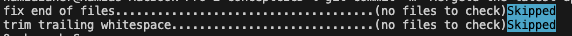
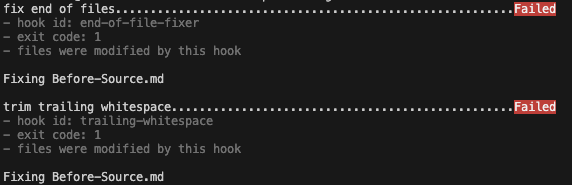
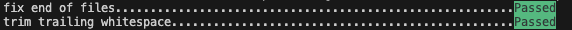

# Main Idea
This file servers as a documentation for the `Dev` branch. This documentation includes:
- Why `Dev` branch was created.
- Installing Pre-commits.
- Push the code to Dev branch.
- Create Branch protection rules.
- Merge your code with the main branch.
- File implementation.

# The Branch Dev
The `Dev` branch was created as an initial stage that allows the developer to relocate his code from the a machine to the remote infrastructure `Github`. Moreover, it's the first step in a CI/CD pipeline.

# Pre-commits
`Pre-commits` are configuration files implemented by the developer to fix common issues with his code or documentation before any commit. Some of this issues can be white spaces, new lines, or spellings.

## Pre-commits: Implementation
To execute this configuration a `.pre-commit-config.yaml` file is created. This file checks all the new `git-added` files for any issues before being committed to any branch.

The issues or test samples are based on `hooks` found in public `repos`. The hooks are based on `ids` which contains rules that checks whetter you files have passed or failed the rules.

For this branch the main rules that are used, are to check for `white spaces` and `EOF` are:
  > - `end-of-file-fixer`
  > - `trailing-whitespace`

The full documentation link :
- https://pre-commit.com/#pre-commit-configyaml---hooks

Please refer to [Pre-Commit-Configuration-File](https://github.com/24ping/ProjectCDCI/blob/Source/.pre-commit-config.yaml)

## Pre-commits: Example
After editing your files, and adding them using the `git add file_name`, The next step is to commit.
when committing, you will be prompt the following:
> If there is no file to check:
> 
>
>
>In case of failure:
> 
>
>
> If successful.
> 
> 

# Pushing the Dev Branch
At this phase, the developer is insuring that the updated code is available remotely through Github, while making sure that his updated files have passed the `pre-commit` checks.

# Branch Protection rules
The purpose of these rules is to ensure that no merge has been done between the main brach and side branches.

There are many rules to be implemented, however, for the simplicity of this branch, since it's the first phase of development, only one rules was implemented.

The rule implemented is a `PR review`, which requires a pull request before merging, then a review for the corresponding request is issued. This review requires a contributor different that the issue whom approves the pull request.

Once the review is approved, then the side branch is merged towards the main branch.

# From Dev Branch -> Main Branch
Following the [Branch protection Rules](<# Branch Protection rules>) to merge this branch, Dev, with the main branch, a pull request is created. After the review is approved the Dev branch is merged to the main branch remotely, then you have to fetch locally the changes to the main branch.

# Implementation Files
To start a project, such as a pipeline, the needed files for this phase `Before-source` is :
  - `Readme.md` documents the whole aspect of this project.
  - `Before-Source.md` documents the aspects of the creation of the `dev` branch.
  - `CodeExample.py` serves as an example code. A code that can be used to test new notions.
  - `.pre-commit-config.yaml` is a checking mechanism that will be used throughout the initialization of this project. This mechanism makes sure that there are no white space or new lines.
